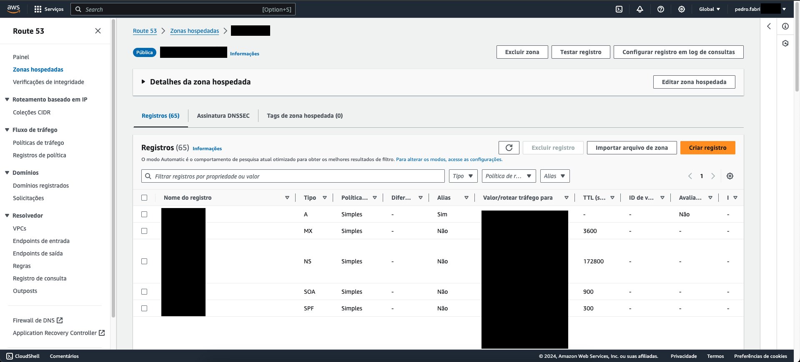

# Route53 Web Console CSV Exporter


> Why spend 5 minutes on a task when you can spend 5 hours automating it?


# Introduction

My security team asked for the configuration of all the hosted zones on Route53 and, as I was trying to export it, I discovered something horrendous: 

**AWS doesn't allow you to export the configuration from the web console.**

So I made this simple script so you can copy-paste it on the console and download the configuration as a CSV file.

# Setup

1. Access the list of records of the hosted zone you want to export:
   
   

2. Download the [Latest Release](https://github.com/pedroafabri/route53-web-csv-exporter/releases/latest) of the script;
3. Copy the script content and paste it on your Dev Console;
4. Done! Now the `export53` function is available on your browser;

# Usage

```javascript
export53(options)
```

`options` is an object that accepts the following parameters:

#### className

The class name of every <tr> on the table of records.
If the AWS someday change this class name, you can use the HTML Inspector of the Dev Console to discover the class used for every <tr> on the table of records and pass the new class name as a parameter.

**Default:** awsui_row_wih1l_15664_301

#### filename

The name of the csv file that will be downloaded.

**Default:** export_53.csv

# "Build"

Just download the repo and run the script `build`. It'll compress the file into `dist/export53.min.js`.

# License

This program is licensed under the GNU GENERAL PUBLIC LICENSE v3.

Why? Because yes, it's open source and the license is important, even if it's a small script like this.

You can read the license [HERE](./LICENSE).